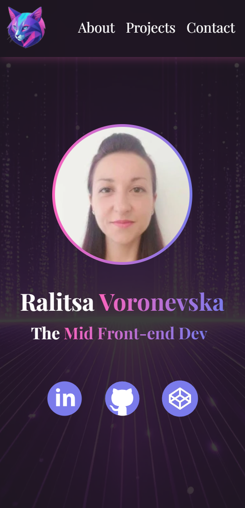
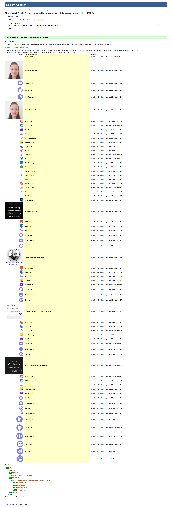
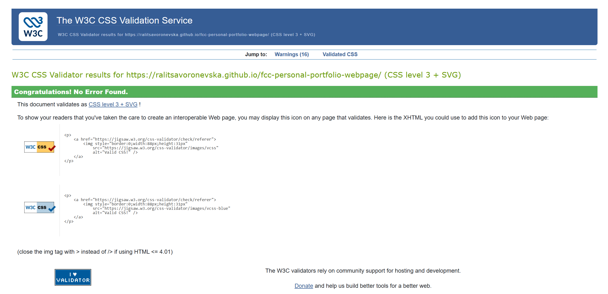
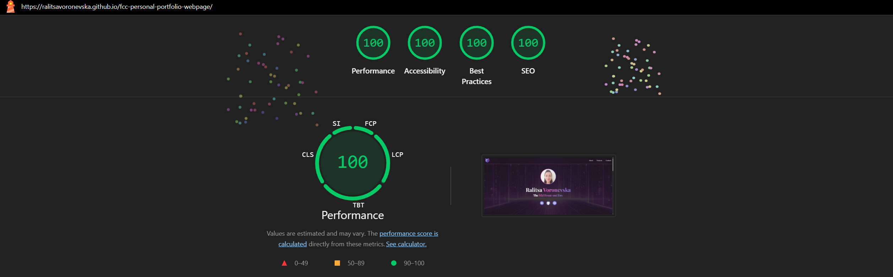
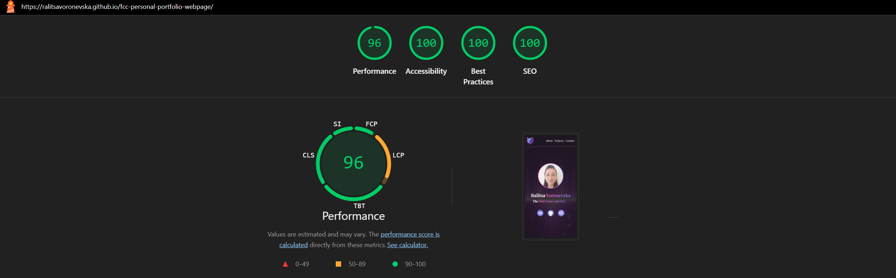
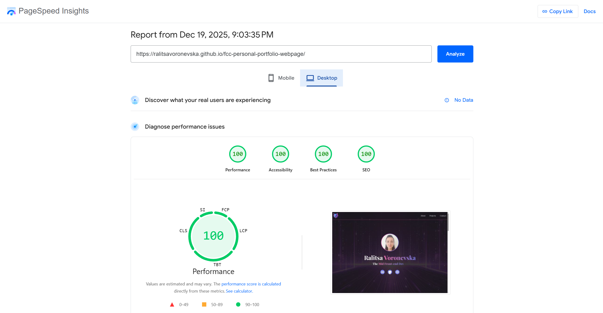
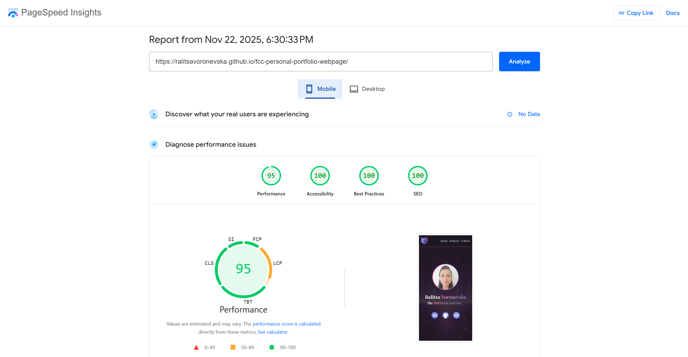

# 🚀 FCC: Build a Personal Portfolio Webpage

📝 [CodePen](https://codepen.io/ralitsavoronevska/pen/KOdQJZ/)
🔗 [Live GitHub Preview](https://ralitsavoronevska.github.io/fcc-personal-portfolio-webpage/)

🎯 FreeCodeCamp Requirements

 

Responsive Web Design Projects - Build a Personal Portfolio Webpage

Objective: Build an app that is functionally similar to https://codepen.io/freeCodeCamp/pen/zNBOYG. Do not copy this demo project.

Fulfill the below user stories and get all of the tests to pass. Give it your own personal style.

> You can use HTML, JavaScript, and CSS to complete this project. Plain CSS is recommended because that is what the lessons have covered so far and you should get some practice with plain CSS. You can use Bootstrap or SASS if you choose. Additional technologies (just for example jQuery, React, Angular, or Vue) are not recommended for this project, and using them is at your own risk. Other projects will give you a chance to work with different technology stacks like React. We will accept and try to fix all issue reports that use the suggested technology stack for this project. Happy coding!

🆔 User Story #1: My portfolio should have a welcome section with an id of welcome-section.                                                           
🔠 User Story #2: The welcome section should have an h1 element that contains text.                                                                   
🆔 User Story #3: My portfolio should have a projects section with an id of projects.                                                                 
🔡 User Story #4: The projects section should contain at least one element with a class of project-tile to hold a project.                            
🔗 User Story #5: The projects section should contain at least one link to a project.                                                                 
🧭 User Story #6: My portfolio should have a navbar with an id of navbar.                                                                             
🔗 User Story #7: The navbar should contain at least one link that I can click on to navigate to different sections of the page.                      
🔗 User Story #8: My portfolio should have a link with an id of profile-link, which opens my GitHub or FCC profile in a new tab.                      
📱 User Story #9: My portfolio should have at least one media query.
↕️ User Story #10: The height of the welcome section should be equal to the height of the viewport.                                                   
🔝 User Story #11: The navbar should always be at the top of the viewport.                                                                            

You can build your project by forking this [CodePen pen](https://codepen.io/freeCodeCamp/pen/MJjpwO/).
Or you can use this CDN link to run the tests in any environment you like:
https://cdn.freecodecamp.org/testable-projects-fcc/v1/bundle.js.
Once you're done, submit the URL to your working project with all its tests passing.
Remember to use the [Read-Search-Ask](https://www.freecodecamp.org/forum/t/how-to-get-help-when-you-are-stuck/19514/) method if you get stuck.

📸 Screenshots

## 🖥️ Desktop preview:

<table width="100%">
  <thead>
    <tr>
      <th width="65%" style="border: none;">📱 Tablet Preview</th>
      <th width="35%" style="border: none;">📱 Mobile Preview</th>
    </tr>
  </thead>
  <tbody>
    <tr>
      <td width="65%"></td>
      <td width="35%"></td>
    </tr>
  </tbody>
</table>

 

# 🏅 W3C HTML Validator

 

# 🏅 W3C CSS Validator

 

# 🌈 Chrome LightHouse Audit

Desktop:

 

Mobile:

 

# ⚡ PageSpeed Insights Results

Desktop:

 

Mobile:

  
        
 

# 🛠️ Built with:

                                                                        
          
🔨 SCSS Files [Fully Responsive, Mobile First Approach, Transitions, Animations & Flex Layout]                                                               
⛏️ [Google Font: Playfair Display](https://fonts.google.com/specimen/Playfair+Display/)                                                                       
🪓 [Bootstrap v5.3](https://getbootstrap.com/docs/5.3/getting-started/introduction/)                                                            
🔩 [Bootstrap v5.3 Card](https://getbootstrap.com/docs/5.3/components/card/)                                                                        
🪚 [Developer Icons](https://devicon.dev/)                                                                                                          

# ✨ Features:
✅ Modern Matrix-like Themed Personal Portfolio Webpage                                                                                            
✅ Fixed navigation with slick blur and smooth scroll                                                                                                        
✅ Showcasing employment with typewritter effect                                                                            
✅ Colourful Classic Developer icons                                                                                                                           
✅ Elegant scroll-to-top button                                                                                                                                
✅ manifest.json                                                                                                                                

# 🧰 Online resources and tools:
                                            
🖼️ [Photopea [Online Photo Editor]](https://www.photopea.com/)      
🪄 [svg minification](https://www.svgviewer.dev/)                                                                                                
🌃 [favicon converter](https://favicon.io/favicon-converter/)       
💫 [tinyjpg image compressor](https://tinyjpg.com/)                                                                             

# 🌐 Browser Support:
(Last updated and tested: 19/12/2025)                                                                                                            
🌟 Chrome 143.0.7499.170 (64-bit)                                                                                                           
🦊 Firefox 146.0.1 (64-bit)                                                                                                                 
🏴‍☠️ Opera 125.0.5729.49 (64-bit)                                                                                                        
🪟 Edge 143.0.3650.96 (64-bit)                                                                                                                   

# 🧪 Online Validators:
✔️ [W3C HTML Validator](https://validator.w3.org/)                                                                                          
✔️ [W3C CSS Validator](https://jigsaw.w3.org/css-validator/)                                                                           
💡 [LightHouse Audit](https://developers.google.com/web/tools/lighthouse/)                                                                  
⚡ [PageSpeed Insights Audit](https://pagespeed.web.dev/)                                                                                         
⭐ [WebPageTest](https://www.webpagetest.org/)                                                                                               

# 🌟 Inspiration & Credits:
🪄 [Grok 4](https://grok.com/)                                                                                                                                
:octocat: [GitHub Coplit](https://github.com/features/copilot)                                                                                                
🌃 [Adobe Firefly](https://firefly.adobe.com/)                                                                                                                
📑 https://mdbootstrap.com/docs/standard/components/cards                                                                                                        
📝 [Typewriter effect using pure javascript](https://codepen.io/aniketkr/pen/xxEYYjW)                                                                            
:globe_with_meridians: [Abdullah Iqbal's Vercel Portfolio](https://abdullah-portfolio-dev.vercel.app/)                                                        
                                                                                                              
---
  
🙌 Thank you for checking out my project! More is coming 🔜.                                                                                           
Stay tuned 🚀 and please don't forget to give the project a star! ⭐                                                                                     
Made with lots of 💗, ☕, and a sprinkle of ✨ by Ralitsa Voronevska!                                                                                